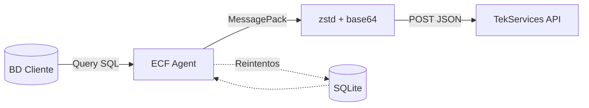

# ECF Data Collection Agent

Agente de recolección de comprobantes fiscales electrónicos (e-CF) para instalación en servidores de clientes.

## ¿Qué hace este agente?

1. **Conecta** a la base de datos del sistema de facturación del cliente
2. **Ejecuta** una query SQL configurada que retorna facturas en formato JSON
3. **Comprime** cada factura (MessagePack + zstd + base64)
4. **Envía** al servidor de TekServices en batches
5. **Reintenta** automáticamente las facturas que fallen



## Características

- 🔌 Soporte multi-BD: MySQL, PostgreSQL, SQL Server, Oracle, SQLite
- 📦 Compresión optimizada (MessagePack + zstd + base64)
- 🔁 Cola de reintentos con SQLite
- ⚙️ Instalación como servicio (Windows/Linux)
- 📊 CLI para gestión y monitoreo

## Instalación Rápida

```bash
# 1. Clonar/copiar el proyecto
cd ecf-agent

# 2. Crear entorno virtual
python -m venv venv
.\venv\Scripts\activate   # Windows
source venv/bin/activate  # Linux/macOS

# 3. Instalar dependencias
pip install -r requirements.txt

# 4. Instalar compresión zstd (recomendado)
pip install msgpack zstandard

# 5. Configurar
cp config/config.example.yaml config/config.yaml
# Editar config.yaml con credenciales de BD y API

# 6. Validar configuración
python -m src.main validate

# 7. Ejecutar
python -m src.main run
```

## Configuración

### Variables de Entorno

```bash
# .env
ECF_API_KEY=your_api_key_here
DB_PASSWORD=your_db_password
```

### Métodos de Compresión

| Método | Descripción | Tamaño | Velocidad |
|--------|-------------|--------|-----------|
| `zstd` (default) | MessagePack + zstd + base64 | ~35% más pequeño | 5-10x más rápido |
| `gzip` | JSON + gzip + base64 | Base | Moderada |
| `none` | Sin compresión | 100% | N/A |

```yaml
# config.yaml
api:
  compression: "zstd"  # Opciones: zstd, gzip, none
```

## Descompresión en el Servidor (Node.js)

El agente envía datos comprimidos con **Base64 + zstd + MessagePack**. Para descomprimir:

```javascript
const { decode } = require('@msgpack/msgpack');
const { ZstdCodec } = require('zstd-codec');

/**
 * Descomprime invoice_data recibido del agente
 * @param {string} compressedBase64 - Datos en formato base64
 * @param {string} compressionMethod - "zstd" | "gzip" | "none"
 * @returns {Promise<object>} - Objeto JSON de la factura
 */
async function decompressInvoiceData(compressedBase64, compressionMethod = 'zstd') {
    if (compressionMethod === 'none') {
        return JSON.parse(compressedBase64);
    }
    
    if (compressionMethod === 'gzip') {
        const zlib = require('zlib');
        const compressedBuffer = Buffer.from(compressedBase64, 'base64');
        const decompressed = zlib.gunzipSync(compressedBuffer);
        return JSON.parse(decompressed.toString('utf-8'));
    }
    
    // zstd (default)
    return new Promise((resolve, reject) => {
        ZstdCodec.run(zstd => {
            try {
                // 1. Base64 → Buffer (bytes comprimidos)
                const compressedBuffer = Buffer.from(compressedBase64, 'base64');
                
                // 2. zstd decompress → bytes MessagePack
                const simple = new zstd.Simple();
                const decompressed = simple.decompress(compressedBuffer);
                
                // 3. MessagePack decode → objeto JavaScript
                const data = decode(decompressed);
                
                resolve(data);
            } catch (error) {
                reject(error);
            }
        });
    });
}

// Uso en Express endpoint
app.post('/private/ecf/dgii-send', async (req, res) => {
    const { compression, invoices } = req.body;
    
    for (const invoice of invoices) {
        const invoiceData = await decompressInvoiceData(
            invoice.invoice_data,
            invoice.compression || compression
        );
        
        console.log('Factura descomprimida:', invoiceData);
        // { ECF: {...}, Detalles: [...], FormasPago: [...] }
    }
    
    res.json({ success: true });
});
```

### Dependencias del servidor

```bash
npm install @msgpack/msgpack zstd-codec
```

## Query SQL

La query configurada debe:
1. Retornar facturas NO procesadas
2. Incluir un campo con el JSON completo de la factura
3. Incluir campos de metadatos (id, ecf, rnc_buyer, total)

Ejemplo para MySQL:
```sql
SELECT 
    e.transaccionid as id,
    e.encf as ecf_number,
    e.RNCComprador as rnc_buyer,
    e.MontoTotal as total_amount,
    JSON_OBJECT(
        'ECF', JSON_OBJECT(...),
        'Detalles', (SELECT JSON_ARRAYAGG(...)),
        'FormasPago', (SELECT JSON_ARRAYAGG(...))
    ) as invoice_json
FROM interfazencf e
WHERE e.procesadadgii = 'N'
LIMIT {batch_size}
```

## Uso

```bash
# Servicio continuo
python -m src.main run

# Una sola ejecución (debug)
python -m src.main once --debug

# Validar configuración
python -m src.main validate

# Ver cola de reintentos
python -m src.main status
```

## Instalación como Servicio

### Windows
```powershell
.\scripts\install_windows.ps1 -Install
.\scripts\install_windows.ps1 -Start
```

### Linux
```bash
sudo ./scripts/install_linux.sh install
sudo systemctl start ecf-agent
```

## Estructura del Proyecto

```
ecf-agent/
├── src/
│   ├── main.py          # Entry point y CLI
│   ├── config.py        # Carga de configuración
│   ├── database/        # Conectores de BD
│   ├── sender/          # Cliente API + compresión
│   ├── queue/           # Cola de reintentos
│   └── scheduler/       # Jobs programados
├── config/
│   └── config.example.yaml
├── scripts/             # Instalación Windows/Linux
├── logs/
└── data/               # SQLite para reintentos
```

## License

MIT
