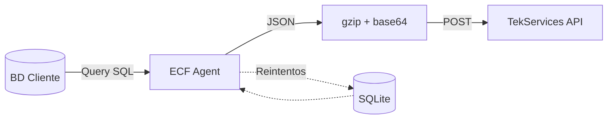

# ECF Data Collection Agent

Agente de recolección de comprobantes fiscales electrónicos (e-CF) para instalación en servidores de clientes.

## ¿Qué hace este agente?

1. **Conecta** a la base de datos del sistema de facturación del cliente
2. **Ejecuta** una query SQL configurada que retorna facturas en formato JSON
3. **Comprime** cada factura (gzip + base64)
4. **Envía** al servidor de TekServices en batches
5. **Reintenta** automáticamente las facturas que fallen



## Características

- 🔌 Soporte multi-BD: MySQL, PostgreSQL, SQL Server, Oracle
- 📦 Compresión automática (gzip + base64)
- 🔁 Cola de reintentos con SQLite
- ⚙️ Instalación como servicio (Windows/Linux)
- 📊 CLI para gestión y monitoreo

## Instalación Rápida

```bash
# 1. Clonar/copiar el proyecto
cd ecf-agent

# 2. Crear entorno virtual
python -m venv venv
.\venv\Scripts\activate   # Windows
source venv/bin/activate  # Linux/macOS

# 3. Instalar dependencias
pip install -r requirements.txt

# 4. Configurar
cp config/config.example.yaml config/config.yaml
# Editar config.yaml con credenciales de BD y API

# 5. Validar configuración
python -m src.main validate

# 6. Ejecutar
python -m src.main run
```

## Configuración

### Variables de Entorno

```bash
# .env
ECF_API_USERNAME=your_api_username
ECF_API_PASSWORD=your_api_password
DB_PASSWORD=your_db_password
```

### Query SQL

La query configurada debe:
1. Retornar facturas NO procesadas
2. Incluir un campo con el JSON completo de la factura
3. Incluir campos de metadatos (id, ecf, rnc_buyer, total)

Ejemplo para MySQL:
```sql
SELECT 
    e.transaccionid as id,
    e.encf as ecf_number,
    e.RNCComprador as rnc_buyer,
    e.MontoTotal as total_amount,
    JSON_OBJECT(
        'ECF', JSON_OBJECT(...),
        'Detalles', (SELECT JSON_ARRAYAGG(...)),
        'FormasPago', (SELECT JSON_ARRAYAGG(...))
    ) as invoice_json
FROM interfazencf e
WHERE e.procesadadgii = 'N'
LIMIT {batch_size}
```

## Uso

```bash
# Servicio continuo
python -m src.main run

# Una sola ejecución (debug)
python -m src.main once --debug

# Validar configuración
python -m src.main validate

# Ver cola de reintentos
python -m src.main status
```

## Instalación como Servicio

### Windows
```powershell
.\scripts\install_windows.ps1 -Install
.\scripts\install_windows.ps1 -Start
```

### Linux
```bash
sudo ./scripts/install_linux.sh install
sudo systemctl start ecf-agent
```

## Estructura del Proyecto

```
ecf-agent/
├── src/
│   ├── main.py          # Entry point y CLI
│   ├── config.py        # Carga de configuración
│   ├── database/        # Conectores de BD
│   ├── sender/          # Cliente API + compresión
│   ├── queue/           # Cola de reintentos
│   └── scheduler/       # Jobs programados
├── config/
│   └── config.example.yaml
├── scripts/             # Instalación Windows/Linux
├── logs/
└── data/               # SQLite para reintentos
```

## License

MIT
